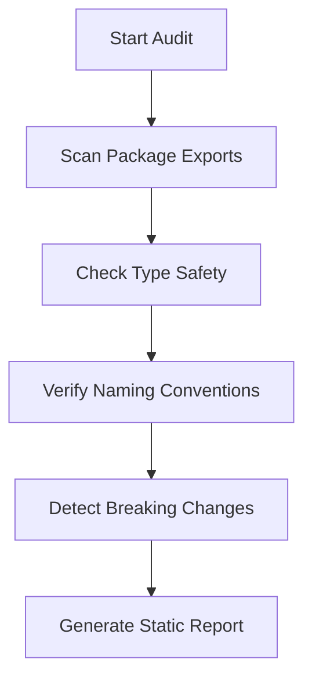
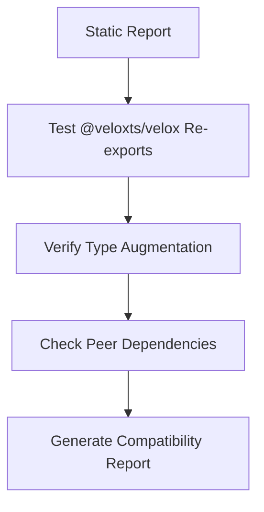
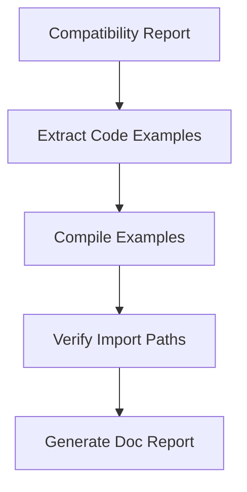

# Framework Contract Guardian Agent

## Overview

The **Framework Contract Guardian** is a specialized agent that audits the VeloxTS framework's public API contracts, type safety, and documentation accuracy before releases. It ensures the framework maintains its core promises: type safety without code generation, Laravel-style elegance, and seamless package interoperability.

## Agent Identity

```yaml
name: framework-contract-guardian
alias: contract-guardian
description: >
  Audits VeloxTS framework packages for API contract integrity, type safety,
  breaking changes, and documentation accuracy. Run before releases to ensure
  the public API surface is consistent, well-typed, and properly documented.
```

## When to Use This Agent

- **Before releases** (v0.x.0 or any npm publish)
- **After significant API changes** to core packages
- **When adding new package exports**
- **During PR review** for changes touching public APIs
- **Periodic health checks** on the framework

## Tools Available

The agent has access to:

| Tool | Purpose |
|------|---------|
| `Glob` | Find TypeScript files, package.json, exports |
| `Grep` | Search for patterns (any, @ts-ignore, exports) |
| `Read` | Read source files, configs, documentation |
| `Bash` | Run TypeScript compiler, tests, build commands |
| `WebFetch` | Check external documentation if needed |

**Note:** This agent is **read-only** by default. It reports issues but does not fix them automatically unless explicitly requested.

---

## Audit Categories

### 1. Type Contract Integrity

**Purpose:** Ensure public types maintain their contracts and no unsafe patterns leak into the API.

#### Checks

| Check ID | Description | Severity |
|----------|-------------|----------|
| `TC-001` | No `any` in public type exports | Critical |
| `TC-002` | No `@ts-ignore` or `@ts-expect-error` in source | Critical |
| `TC-003` | All public functions have explicit return types | Warning |
| `TC-004` | Generic constraints are properly bounded | Error |
| `TC-005` | No `unknown` leaking to user-facing APIs without guards | Warning |
| `TC-006` | Procedure builder chain maintains type inference | Critical |
| `TC-007` | Context type augmentation works correctly | Error |

#### Implementation

```typescript
// TC-001: Scan for 'any' in public exports
// Files: packages/*/src/index.ts, packages/*/src/types.ts
// Pattern: /export.*:\s*any|export.*<.*any.*>/

// TC-002: No escape hatches
// Pattern: /@ts-ignore|@ts-expect-error|as any/

// TC-006: Type inference chain test
// Compile: packages/router/src/__type-tests__/*.ts
// Ensure: No type errors, inferred types match expected
```

---

### 2. Public API Surface

**Purpose:** Ensure exports are intentional, consistent, and follow naming conventions.

#### Checks

| Check ID | Description | Severity |
|----------|-------------|----------|
| `API-001` | All public exports are documented in index.ts | Error |
| `API-002` | No internal modules accidentally exported | Critical |
| `API-003` | Export names follow conventions (camelCase functions, PascalCase types) | Warning |
| `API-004` | Barrel exports don't cause circular dependencies | Error |
| `API-005` | Package.json exports field matches actual exports | Critical |
| `API-006` | Subpath exports are properly configured | Error |

#### Implementation

```typescript
// API-001: Cross-reference exports with JSDoc
// For each export in index.ts, verify JSDoc exists

// API-005: Validate package.json exports
// Parse package.json "exports" field
// Verify each path resolves to actual file
// Check types field points to .d.ts

// Example package.json exports validation:
{
  "exports": {
    ".": {
      "types": "./dist/index.d.ts",  // Must exist
      "import": "./dist/index.js"    // Must exist
    },
    "./testing": {
      "types": "./dist/testing.d.ts",
      "import": "./dist/testing.js"
    }
  }
}
```

---

### 3. Breaking Change Detection

**Purpose:** Identify changes that would break existing user code.

#### Checks

| Check ID | Description | Severity |
|----------|-------------|----------|
| `BC-001` | Removed exports from previous version | Critical |
| `BC-002` | Changed function signatures (params added/removed) | Critical |
| `BC-003` | Changed type definitions narrowing | Error |
| `BC-004` | Changed default values | Warning |
| `BC-005` | Renamed exports without alias | Critical |
| `BC-006` | Changed generic parameter count | Critical |

#### Implementation

```bash
# Compare current exports with last release tag
git diff v0.6.84..HEAD -- packages/*/src/index.ts

# Look for:
# - Removed 'export' lines
# - Changed function parameters
# - Removed type exports
```

#### Breaking Change Report Format

```markdown
## Breaking Changes Detected

### @veloxts/router

#### BC-001: Removed Export
- **Export:** `createLegacyRouter`
- **Last seen:** v0.6.80
- **Impact:** High - Users importing this will get compile errors
- **Migration:** Use `createRouter` instead

#### BC-002: Signature Change
- **Function:** `procedure().guard()`
- **Before:** `guard(fn: GuardFunction): Builder`
- **After:** `guard(def: GuardDefinition): Builder`
- **Impact:** Medium - Type-only change, runtime compatible
- **Migration:** Wrap function in `defineGuard()`
```

---

### 4. Cross-Package Compatibility

**Purpose:** Ensure all @veloxts packages work together seamlessly.

#### Checks

| Check ID | Description | Severity |
|----------|-------------|----------|
| `CP-001` | Shared types are compatible across packages | Critical |
| `CP-002` | Peer dependency versions are aligned | Error |
| `CP-003` | @veloxts/velox re-exports all expected symbols | Critical |
| `CP-004` | Type augmentation from one package works in another | Error |
| `CP-005` | No duplicate type definitions across packages | Warning |

#### Implementation

```typescript
// CP-001: GuardLike compatibility test
// @veloxts/auth defines GuardDefinition
// @veloxts/router accepts GuardLike
// Verify: GuardDefinition extends GuardLike

// CP-003: Velox meta-package completeness
// For each package in [core, router, validation, orm, auth]:
//   For each export in package/src/index.ts:
//     Verify export available from @veloxts/velox

// CP-004: Context augmentation test
// Define: declare module '@veloxts/core' { interface BaseContext { db: PrismaClient } }
// Verify: ctx.db is typed in procedure handlers
```

---

### 5. Documentation Accuracy

**Purpose:** Ensure documentation matches actual implementation.

#### Checks

| Check ID | Description | Severity |
|----------|-------------|----------|
| `DOC-001` | Code examples in docs compile without errors | Error |
| `DOC-002` | Documented APIs actually exist | Critical |
| `DOC-003` | JSDoc matches function implementation | Warning |
| `DOC-004` | README examples are up to date | Warning |
| `DOC-005` | CLAUDE.md reflects current API | Error |

#### Implementation

```typescript
// DOC-001: Extract and compile code examples
// Parse: apps/docs/src/content/docs/**/*.mdx
// Extract: ```typescript blocks
// Compile: With tsconfig strict mode
// Report: Any type errors

// DOC-002: Verify documented imports exist
// Parse: import { X } from '@veloxts/Y'
// Verify: X is exported from @veloxts/Y
```

---

### 6. Naming Convention Compliance

**Purpose:** Ensure Laravel-style naming elegance throughout the API.

#### Checks

| Check ID | Description | Severity |
|----------|-------------|----------|
| `NC-001` | Function exports use camelCase | Warning |
| `NC-002` | Type/Interface exports use PascalCase | Warning |
| `NC-003` | Constants use SCREAMING_SNAKE_CASE | Info |
| `NC-004` | Procedure names follow REST conventions | Warning |
| `NC-005` | Guard names are descriptive (is*, has*, can*) | Info |
| `NC-006` | No abbreviations in public API (use `authentication` not `auth` in names) | Info |

#### Laravel-Inspired Patterns

```typescript
// Good - Expressive, readable
defineGuard({ name: 'isVerified', ... })
procedure().guard(authenticated).query(handler)
sessionMiddleware({ secret: '...' })

// Avoid - Cryptic, abbreviated
defG({ n: 'ver', ... })
proc().g(auth).q(h)
sessMw({ s: '...' })
```

---

### 7. Security Audit

**Purpose:** Identify potential security issues in the API design.

#### Checks

| Check ID | Description | Severity |
|----------|-------------|----------|
| `SEC-001` | No secrets in default configurations | Critical |
| `SEC-002` | Secure defaults for auth (httpOnly, secure cookies) | Critical |
| `SEC-003` | No eval() or Function() in source | Critical |
| `SEC-004` | SQL injection protection in ORM helpers | Critical |
| `SEC-005` | CSRF protection enabled by default | Error |

---

## Audit Workflow

### Phase 1: Static Analysis (Automated)



**Commands:**
```bash
# Build all packages first
pnpm build

# Type check
pnpm type-check

# Lint
pnpm lint
```

### Phase 2: Cross-Package Verification



**Commands:**
```bash
# Run type tests
pnpm test --filter="*type*"

# Verify velox exports
node -e "const v = require('@veloxts/velox'); console.log(Object.keys(v).length)"
```

### Phase 3: Documentation Validation



### Phase 4: Final Report Generation

Consolidate all findings into a single release readiness report.

---

## Output Format

### Summary Report

```markdown
# VeloxTS Framework Contract Audit
**Date:** 2026-01-22
**Version:** 0.6.85
**Auditor:** framework-contract-guardian

## Executive Summary

| Category | Pass | Warn | Error | Critical |
|----------|------|------|-------|----------|
| Type Contracts | 45 | 2 | 0 | 0 |
| Public API | 38 | 1 | 0 | 0 |
| Breaking Changes | - | 0 | 0 | 0 |
| Cross-Package | 12 | 0 | 0 | 0 |
| Documentation | 28 | 3 | 1 | 0 |
| Naming | 52 | 4 | 0 | 0 |
| Security | 8 | 0 | 0 | 0 |

**Release Readiness:** ✅ READY (with 10 warnings to address)

## Critical Issues (0)
None.

## Errors (1)
### DOC-001: Code example compilation failure
- **File:** apps/docs/src/content/docs/router/middleware.mdx
- **Line:** 45
- **Error:** `Property 'rateLimit' does not exist on type 'Context'`
- **Fix:** Add `@veloxts/auth` import to example

## Warnings (10)
[... detailed list ...]
```

### Machine-Readable Output

```json
{
  "version": "0.6.85",
  "timestamp": "2026-01-22T17:00:00Z",
  "summary": {
    "total_checks": 183,
    "passed": 172,
    "warnings": 10,
    "errors": 1,
    "critical": 0
  },
  "release_ready": true,
  "issues": [
    {
      "id": "DOC-001",
      "severity": "error",
      "category": "documentation",
      "file": "apps/docs/src/content/docs/router/middleware.mdx",
      "line": 45,
      "message": "Code example compilation failure",
      "details": "Property 'rateLimit' does not exist on type 'Context'"
    }
  ]
}
```

---

## Integration Points

### 1. Manual Invocation

```bash
# In Claude Code
> Run the framework contract guardian audit for the upcoming v0.7.0 release
```

### 2. Pre-Release Checklist

Add to release process:
```markdown
## Release Checklist

- [ ] All tests pass (`pnpm test`)
- [ ] Type check passes (`pnpm type-check`)
- [ ] Lint passes (`pnpm lint`)
- [ ] **Contract Guardian audit passes** ← NEW
- [ ] Changelog updated
- [ ] Version bumped
```

### 3. CI Integration (Future)

```yaml
# .github/workflows/contract-audit.yml
name: Contract Audit
on:
  pull_request:
    paths:
      - 'packages/*/src/index.ts'
      - 'packages/*/src/types.ts'
      - 'packages/*/package.json'

jobs:
  audit:
    runs-on: ubuntu-latest
    steps:
      - uses: actions/checkout@v4
      - run: pnpm install
      - run: pnpm build
      - run: pnpm contract-audit  # Future CLI command
```

---

## Agent Prompt Template

When invoking this agent, use:

```
Perform a framework contract audit for VeloxTS.

Focus areas (select applicable):
- [ ] Full audit (all categories)
- [ ] Type safety only
- [ ] Breaking change detection (compare with v{VERSION})
- [ ] Documentation accuracy
- [ ] Pre-release check for v{VERSION}

Output format:
- [ ] Summary report (markdown)
- [ ] Detailed findings
- [ ] Machine-readable JSON

Additional context:
{Any specific concerns or areas to focus on}
```

---

## Maintenance

### Adding New Checks

1. Define check ID, description, severity
2. Add to appropriate category
3. Implement detection logic
4. Add to test suite
5. Update this specification

### Severity Definitions

| Level | Definition | Release Impact |
|-------|------------|----------------|
| **Critical** | Breaks user code or security vulnerability | Blocks release |
| **Error** | Significant issue, likely to cause problems | Should fix before release |
| **Warning** | Minor issue, code smell, or inconsistency | Document or fix |
| **Info** | Suggestion for improvement | Optional |

---

## Example Audit Session

```
User: Run framework contract guardian for pre-release v0.7.0

Agent: Starting VeloxTS Framework Contract Audit for v0.7.0...

## Phase 1: Static Analysis
✓ Building packages... done (12.3s)
✓ Type checking... done (8.1s)
✓ Scanning exports... found 247 public exports across 6 packages

## Phase 2: Type Contract Checks
✓ TC-001: No `any` in public exports... PASS (247/247)
✓ TC-002: No escape hatches... PASS
✓ TC-006: Type inference chain... PASS

## Phase 3: Breaking Change Detection
Comparing with v0.6.84...
✓ No removed exports
✓ No signature changes
⚠ BC-004: Default value changed
  - `pagination()` defaultLimit: 20 → 25

## Phase 4: Documentation Validation
✓ 45 code examples compiled successfully
✗ DOC-001: 1 example failed to compile
  - middleware.mdx:45 - missing import

## Summary
Release Readiness: ✅ READY
- 1 error (should fix)
- 1 warning (document in changelog)

Recommended actions before release:
1. Fix middleware.mdx example (add @veloxts/auth import)
2. Document pagination default change in CHANGELOG.md
```

---

## Related Agents

| Agent | Relationship |
|-------|--------------|
| `ts-code-reviewer` | Reviews implementation; Guardian reviews contracts |
| `typescript-expert` | Helps fix type issues found by Guardian |
| `technical-documentation-writer` | Updates docs flagged by Guardian |
| `laravel-syntax-perfectionist` | Reviews naming conventions |

---

## Version History

| Version | Date | Changes |
|---------|------|---------|
| 1.0.0 | 2026-01-22 | Initial specification |
